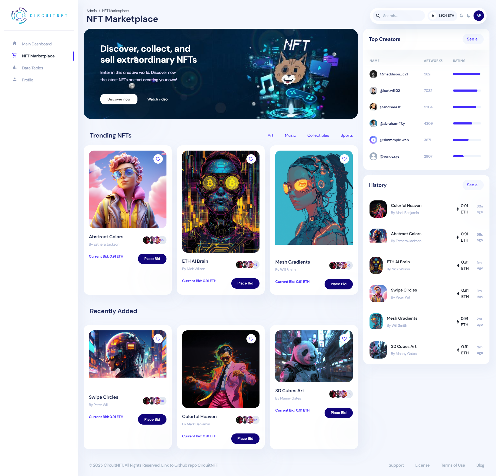

# CircuitNFT

**CircuitNFT** is a next-generation NFT marketplace designed with a microservices architecture, enabling seamless integration of blockchain, backend, and frontend technologies. This project leverages **React** for the frontend, **Node.js** with **Express** for the backend, and blockchain smart contracts for NFT creation and management.

---

## Table of Contents

1. [Overview](#overview)
2. [Preview](#preview)
3. [Project Structure](#project-structure)
4. [Technologies](#technologies)
5. [Installation](#installation)
6. [Contact](#contact)
7. [Contributing](#contributing)
8. [License](#license)

---

## Overview

CircuitNFT is a decentralized marketplace that allows users to create, buy, and sell NFTs. The platform is built using a microservices approach, providing scalability and flexibility for future growth. The frontend is crafted with React and integrated with the backend API for seamless interactions. The blockchain component enables the minting, sale, and transfer of NFTs through Solidity smart contracts.

---

## Preview



> Place the `screenshot.png` file in the root directory for this link to work correctly.

---

## Project Structure

The project is divided into three main parts:

- **Frontend**: The user-facing application built with React.js.
- **Backend**: The Node.js server that handles API requests, user authentication, and interactions with the blockchain.
- **Blockchain**: Smart contracts written in Solidity for managing NFTs.

Here’s an overview of the folder structure:

---

## Technologies

- **Frontend**: 
  - React.js
  - JavaScript (ES6+)
  - Redux (optional for state management)
  - viem or Ethers.js (for blockchain interaction)

- **Backend**:
  - Node.js
  - Express.js
  - MongoDB (for data storage)
  - RESTful API

- **Blockchain**:
  - Solidity
  - Ethereum (for smart contracts)
  - Hardhat (for smart contract development and testing)

---

## Installation

To get started with CircuitNFT, follow the instructions below.

### Prerequisites

Before you begin, ensure that you have the following installed:

- [Node.js](https://nodejs.org/)
- [MongoDB](https://www.mongodb.com/try/download/community) (for the backend)
- [Docker](https://www.docker.com/get-started) (for containerized setup)
- [Solidity](https://soliditylang.org/) (for smart contract development)

---

### Step 1: Clone the repository

Clone the repository to your local machine:

```bash
git clone https://github.com/yourusername/CircuitNFT.git
cd CircuitNFT
```
---

### Step 2: Set up the frontend

Navigate to the frontend directory and install dependencies:

```bash
cd frontend
npm install
```

### Step 3: Set up the backend

Navigate to the backend directory and install dependencies:

```bash
cd ./backend
npm install
```
Create a .env file in the root directory and add your environment variables (e.g., MongoDB URL, Blockchain API keys, etc.):

```bash
MONGO_URI=mongodb+srv://your-database-name
```

### Step 4: Set up the blockchain

Navigate to the blockchain directory and install dependencies:

```bash
cd ./blockchain
npm install
```
### Step 5: Set up environment variables

Create a .env file in the root directory and add your environment variables (e.g., MongoDB URL, Blockchain API keys, etc.):

```bash
DATABASE_URL=your_database_url
PRIVATE_KEY=your_secret_key
ETHERSCAN_API_KEY=ETHERSCAN_API_KEY
```
### Step 6: Start the services

Use Docker Compose to start all services at once:

```bash
docker-compose up --build
```

Alternatively, you can start each service individually:

Frontend: npm start in the frontend directory.
Backend: npm start in the backend directory.
Blockchain: Deploy smart contracts to a local test network using Truffle or Hardhat.

Usage
Once the services are up and running, you can access:

Frontend: http://localhost:3000 (React app)
Backend: http://localhost:5000 (API server)
Blockchain: Local Ethereum node or a test network for smart contract interaction.

---

## Contact
If you have any questions or suggestions, feel free to reach out:

- **Portfolio:** [PhilosTech](https://philostech.github.io/portfoliopavlof/)
- **LinkedIn:** [Your LinkedIn Profile](https://www.linkedin.com/in/pavlo-filonenko-65278820a/)
- **GitHub:** [PhilosTech](https://github.com/PhilosTech)

---

## Contributing
We welcome contributions! To contribute:
1. Fork the repository.
2. Create a new branch for your feature or bug fix.
3. Submit a pull request with a clear explanation of the changes.

---

## License
This project is licensed under the [MIT License](LICENSE).